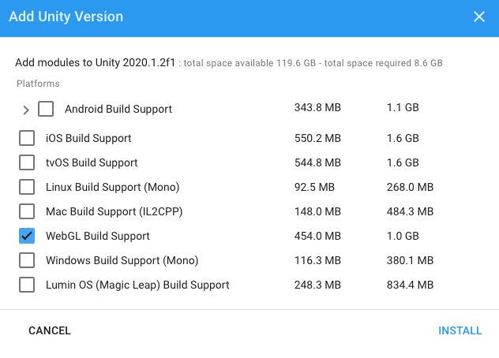
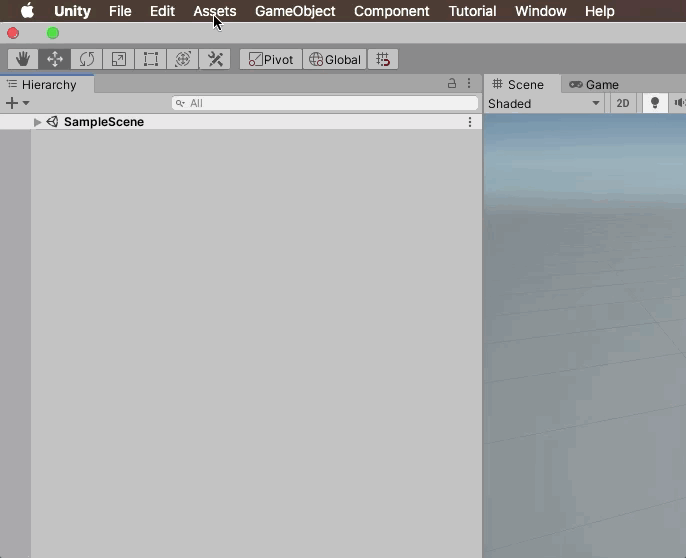
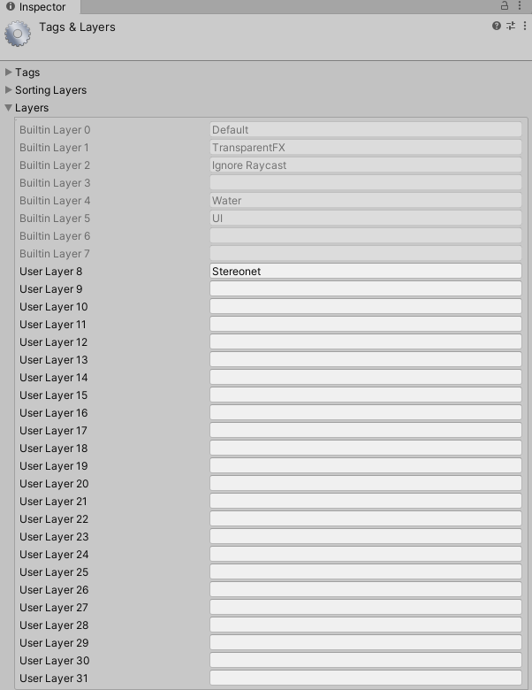
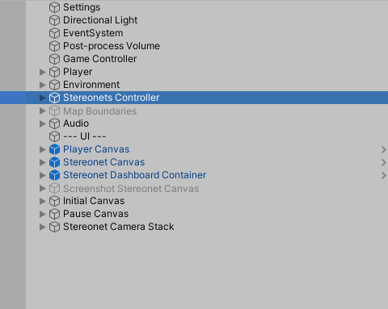
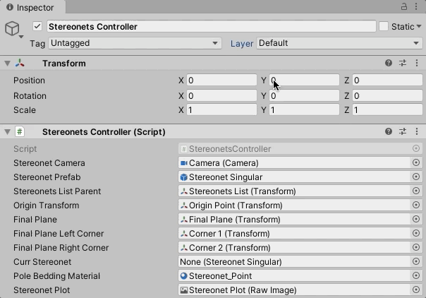
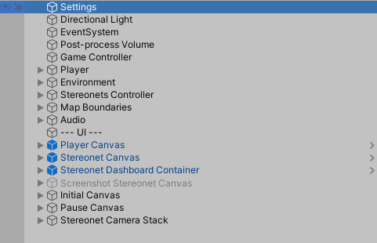
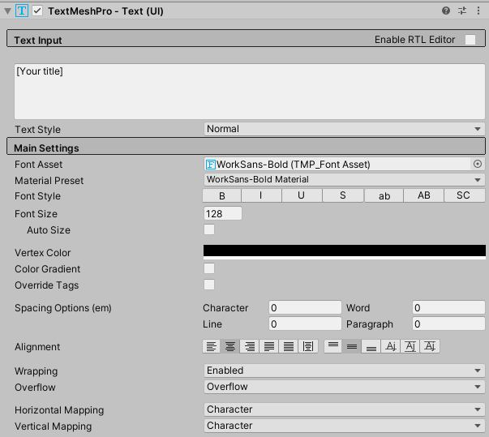
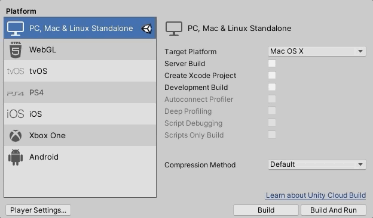
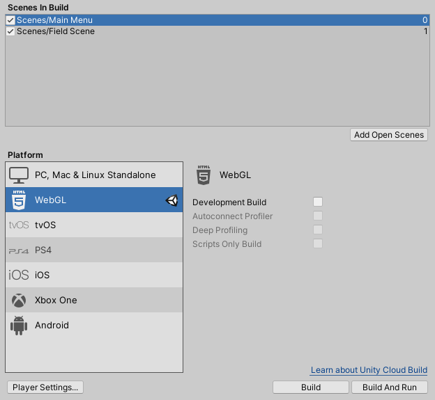

# Structural Geology Query Toolkit

This guide assumes you are a complete newcomer to using the Untiy game engine.

## Installing Unity

### Install Unity Hub

Unity Hub is a tool where you can manage all your Unity projects and Unity editors.

https://store.unity.com/download?ref=personal

### Adding a new Unity version

After installing install Unity Hub, you will need to download an actual Unity editor to go with it. This project was developed using Unity **2020.1.2**, so we recommend using the same version. Other versions may work as well.

Go to [Unity Archive](https://unity3d.com/get-unity/download/archive) and select the Unity Hub option for 2020.1.2.

### Adding the WebGL module to your Unity version

In Unity Hub, you will see this popup. Check the "WebGL Build Support" to be able to build on WebGL platforms.

## Creating a new project through Unity Hub

Then, create a new project with the Universal Render Pipeline.

## Downloading the Structural Query Toolkit package

Head to our releases section and download the latest package. This package will be imported into your new  Unity project.

This is the only file you need to download.

## Importing the Structural Query Toolkit Package

After downloding the package, import it into your project.

## Setting up the scene

### Open the scene

After importing the package, open the scene called "Field Scene" inside "Assets/Scenes"

This scene is where you will insert your own model to be used ingame.

[TODO picture of scene]

### Setting the aspect ratio for your editor play mode

The UI may look weird when the game screen is not in 16:9 or 16:10. Note that this does not affect the final build of the project, where its default non-fullscreen resolution is defined elsewhere. This simply gives you a better preview of the ingame look.

### Adding the "Stereonet" layer

Since Unity packages cannot import layers, you must manually assign the layer "Stereonet" to "Stereonets Controller" gameobject and its children. Doing this will allow the 2D stereoent in the project to work.

First, Select any gameobject under the "hierarchy" tab and open the layers window.

Then, add a new layer called "Stereonet"

Lastly, select the "Stereonets Controller" gameobject in the hierarchy tab, and in the inspector, assign the Stereonet layer.

Select "Yes, change children"

### Switching the example model with your model

[TODO]

### Moving the player gameobject to your desired position

[TODO]

### (Optional) Enabling sampling radius

To mitigate the effects of noise during your measurements, you can enable the sampling of multiple points around your clicks.

By default, random sampling is disabled. To enable it or to change its settings, go to the "Settings" gameobject in your hierarchy view.

So see how random sampling works, turn on the "Gizmos" toggle in the top-right corner of your **game** tab (not scene view!)

Next, go into play mode what start taking measurements! You will see white lines representing the extra measurements that are taking place and are used when plotting the stereonet.

With the default settings, you should see something similar to this:

**Note:** the visuals you see when "Gizmos" is enabled is only seen inside the editor, and not in the final build.

### (Optional) Setting your model's altitude

Do you want to see the elevation of your measurements? If so, you will need to adjust the model's position in the y-axis.

**Important:** this step is only relevant if you have visible GPS markers in your model that allows you to derive its elevation data.

**Note:** The Unity game engine uses the metric system, so one unit is one meter. Scale and translate your model accordingly.

#### Short demonstration

[TODO]

By default, showing elevation data is turned off. To enable it, find the "Settings" GameObject in the scene hierarchy, and enable "Show Elevation Data"

You should now see the elevation of your latest measurements

## Setting up the main menu

This package includes a simple main menu screen.

We will show how to change the title its subheading.

Open the scene called "Main menu" inside "Assets/Scenes"

In the hierarchy tab, open the "Manu Canvas" gameobject to find the "Title" and "Subheader" gameobjects.

Once you select either the title of subheader, you will see a TextMeshPro component. Simply change the placeholder text.

This scene also includes a simple acknowledgements page, named "Acknowledgements Canvas" in the hierarchy tab. We recommend temperarily disabling the Menu Canvas to better edit this page.

## Building to WebGL

It's very important that your build settings look exactly like in the screenshots below!

First, open the "Build Settings..." window

If you see any scenes that are blank or are not either your main menu scene or the field scene, then delete it (click on it and delete). By default, you will most likely see a "Sample Scene," which you should delete (or if you deleted the sample scene in your project, then you will see a blank entry).

Now, **open your main menu scene** (Assets/Scenes/Main Menu), and reopen the "Build Settings..." window, then select "Add open scenes."

Next, open your field scene and repeat.

Lastly, under "Platforms" in the "Build Settings..." window, select WebGL and select "Switch Platform"

This is how your final build settings should look. Build order is important for the main menu to work!

Now you can build your project. Note that building your project can be a slow process. 

## Publishing online

[TODO]